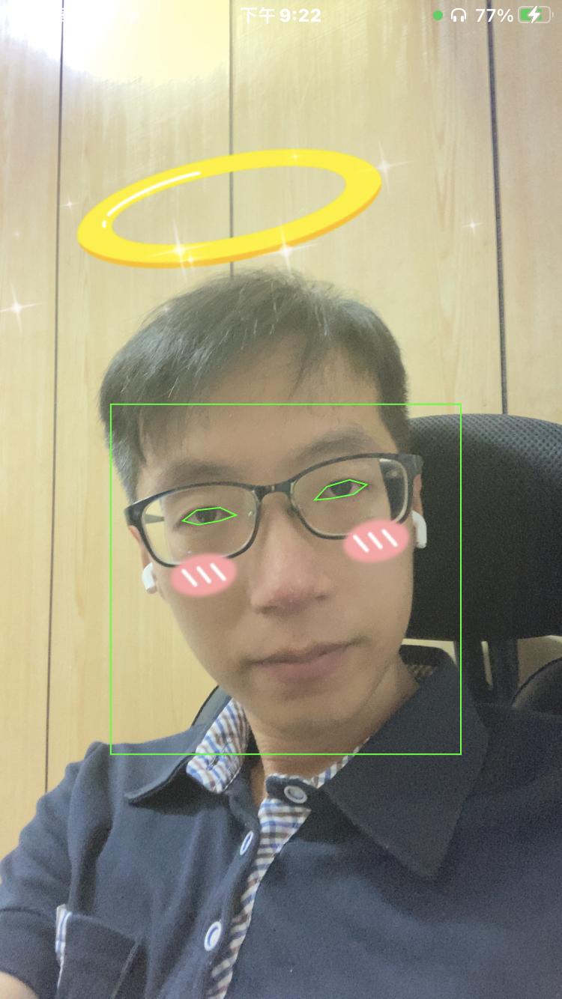

# IRMusicPlayer 

- IRMusicPlayer is a powerful music player for iOS.

## Features
- Support online/local play.
- Support to show music cover.
- Support randon mode.
- Support repeat modes: repeat all musics once, repeat current music forever, repeat all musics forever.

## Future
- Support background play.

## How does it work?

```
Starting with iOS 13, you will get a different set of points (VNDetectFaceLandmarksRequestRevision3) 
```

- Get size of camera layer.
```objc
AVCaptureVideoDataOutput *output = [[[self.videoCamera captureSession] outputs] lastObject];
NSDictionary* outputSettings = [output videoSettings];

long width  = [[outputSettings objectForKey:@"Width"]  longValue];
long height = [[outputSettings objectForKey:@"Height"] longValue];
```

- Conver points
```objc
size_t width = CVPixelBufferGetWidth(CVPixelBufferRef);
size_t height = CVPixelBufferGetHeight(CVPixelBufferRef);

CGSize size = CGSizeMake(width, height);

CGFloat scaleX = self.filterView.layer.frame.size.width / size.width;
CGFloat scaleY = self.filterView.layer.frame.size.height / size.height;

CGAffineTransform transform = CGAffineTransformTranslate(CGAffineTransformMakeScale(scaleX, -scaleY), 0, -1);

CGRect faceBoundingBoxOnScreen = VNImageRectForNormalizedRect(CGRectApplyAffineTransform(observedFace.boundingBox, transform), size.width, size.height);
```

```objc
CGRect faceBoundingBoxOnScreen = CGRectZero;
faceBoundingBoxOnScreen.size.height = self.filterView.layer.frame.size.height * observedFace.boundingBox.size.height;
faceBoundingBoxOnScreen.size.width = self.filterView.layer.frame.size.width * observedFace.boundingBox.size.width;
faceBoundingBoxOnScreen.origin.x = observedFace.boundingBox.origin.x * self.filterView.layer.frame.size.width;
faceBoundingBoxOnScreen.origin.y = observedFace.boundingBox.origin.y * self.filterView.layer.frame.size.height;
```

- Eyes

- 1.
```objc
for (int i = 0; i < eye.pointCount; i++) {
    CGPoint eyePoint = eye.normalizedPoints[i];
    CGRect faceBounds = VNImageRectForNormalizedRect(screenBoundingBox, size.width, size.height);

    CGAffineTransform transform = CGAffineTransformScale(CGAffineTransformMakeTranslation(faceBounds.origin.x, faceBounds.origin.y), faceBounds.size.width, faceBounds.size.height);

    eyePoint = CGPointApplyAffineTransform(eyePoint, transform);

    CGFloat scaleX = self.filterView.layer.frame.size.width / size.width;
    CGFloat scaleY = self.filterView.layer.frame.size.height / size.height;

    transform = CGAffineTransformTranslate(CGAffineTransformMakeScale(scaleX, -scaleY), 0, -size.height);

    eyePoint = CGPointApplyAffineTransform(eyePoint, transform);
}
```

- 2.
```objc
const CGPoint *pointsInImage = [eye pointsInImageOfSize:CGSizeMake(size.width, size.height)];
for (int i = 0; i < eye.pointCount; i++) {
    CGPoint eyePoint = pointsInImage[i];

    CGFloat scaleX = self.filterView.layer.frame.size.width / size.width;
    CGFloat scaleY = self.filterView.layer.frame.size.height / size.height;
    
    CGAffineTransform transform = CGAffineTransformTranslate(CGAffineTransformMakeScale(scaleX, -scaleY), 0, -size.height);

    eyePoint = CGPointApplyAffineTransform(eyePoint, transform);

    newEyePoints[i] = eyePoint;
    [newEyePointsArray addObject:[NSValue valueWithCGPoint:eyePoint]];
}
```

- All points
```objc
NSMutableArray *newAllPointsArray = [NSMutableArray array];
const CGPoint *pointsInImage = [landmarks.allPoints pointsInImageOfSize:CGSizeMake(size.width, size.height)];
for (int i = 0; i < landmarks.allPoints.pointCount; i++) {
    CGPoint eyePoint = pointsInImage[i];

    CGFloat scaleX = (self.filterView.layer.frame.size.width / size.width) * (size.height / self.filterView.layer.frame.size.width);
    CGFloat scaleY = (self.filterView.layer.frame.size.height / size.height) * (size.width / self.filterView.layer.frame.size.height);
    
    CGAffineTransform transform = CGAffineTransformTranslate(CGAffineTransformMakeScale(scaleX, -scaleY), 0, -size.height);
    
    eyePoint = CGPointApplyAffineTransform(eyePoint, transform);
    
    [newAllPointsArray addObject:[NSValue valueWithCGPoint:eyePoint]];
}
```

## Install
### Git
- Git clone this project.
- Copy this project into your own project.
- Add the .xcodeproj into you  project and link it as embed framework.
#### Options
- You can remove the `demo` and `ScreenShots` folder.

### Cocoapods
- Add `pod 'IRMusicPlayer'`  in the `Podfile`
- `pod install`

## Usage

### Basic
```obj-c
@import IRMusicPlayer;

MusicPlayerViewController *vc = [[MusicPlayerViewController alloc] initWithNibName:@"MusicPlayerViewController" bundle:xibBundle];

[vc.musicListArray addObject:@{@"musicAddress": [[NSBundle mainBundle] pathForResource:@"1" ofType:@"mp3"]}];
[vc.musicListArray addObject:@{@"musicAddress": [[NSBundle mainBundle] pathForResource:@"2" ofType:@"mp3"]}];
[vc.musicListArray addObject:@{@"musicAddress": [[NSBundle mainBundle] pathForResource:@"3" ofType:@"mp3"]}];

[self presentViewController:vc animated:YES completion:nil];
```

### Advanced settings
- Use `MusicPlayerViewCallBackDelegate`.
```obj-c
@protocol MusicPlayerViewCallBackDelegate <NSObject>
-(void)didMusicChange:(NSString*)path;
@end
```

- Set `musicIndex` to controll which you want to play.
```obj-c
musicPlayerVC.musicIndex = 1;
[musicPlayerVC doPlay];
```

- Make your custome music cover image.
```obj-c
musicPlayerVC.coverView.image = <Csutom image>;
```

## Screenshots

