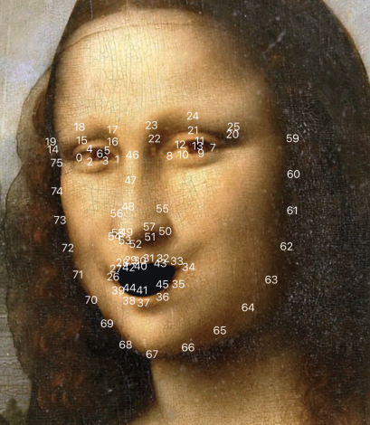

# IRCameraSticker 

- IRCameraSticker is a powerful face sticker and camera sticker for iOS.

## Features
- Support face sticker.
- Support GPUImage.

## Future
- Support more customized settings.

## How does it work?

- Using `VNDetectFaceLandmarksRequestRevision3`
```objc
Starting with iOS 13, you will get a different set of points (VNDetectFaceLandmarksRequestRevision3) 
```

- Get size of camera layer.
```objc
AVCaptureVideoDataOutput *output = [[[self.videoCamera captureSession] outputs] lastObject];
NSDictionary* outputSettings = [output videoSettings];

long width  = [[outputSettings objectForKey:@"Width"]  longValue];
long height = [[outputSettings objectForKey:@"Height"] longValue];
```

- Conver points

- 1. Method one
```objc
size_t width = CVPixelBufferGetWidth(CVPixelBufferRef);
size_t height = CVPixelBufferGetHeight(CVPixelBufferRef);

CGSize size = CGSizeMake(width, height);

CGFloat scaleX = self.filterView.layer.frame.size.width / size.width;
CGFloat scaleY = self.filterView.layer.frame.size.height / size.height;

CGAffineTransform transform = CGAffineTransformTranslate(CGAffineTransformMakeScale(scaleX, -scaleY), 0, -1);

CGRect faceBoundingBoxOnScreen = VNImageRectForNormalizedRect(CGRectApplyAffineTransform(observedFace.boundingBox, transform), size.width, size.height);
```

- 2. Method two
```objc
CGRect faceBoundingBoxOnScreen = CGRectZero;
faceBoundingBoxOnScreen.size.height = self.filterView.layer.frame.size.height * observedFace.boundingBox.size.height;
faceBoundingBoxOnScreen.size.width = self.filterView.layer.frame.size.width * observedFace.boundingBox.size.width;
faceBoundingBoxOnScreen.origin.x = observedFace.boundingBox.origin.x * self.filterView.layer.frame.size.width;
faceBoundingBoxOnScreen.origin.y = observedFace.boundingBox.origin.y * self.filterView.layer.frame.size.height;
```

- Eyes

- 1. Method one
```objc
for (int i = 0; i < eye.pointCount; i++) {
    CGPoint eyePoint = eye.normalizedPoints[i];
    CGRect faceBounds = VNImageRectForNormalizedRect(screenBoundingBox, size.width, size.height);

    CGAffineTransform transform = CGAffineTransformScale(CGAffineTransformMakeTranslation(faceBounds.origin.x, faceBounds.origin.y), faceBounds.size.width, faceBounds.size.height);

    eyePoint = CGPointApplyAffineTransform(eyePoint, transform);

    CGFloat scaleX = self.filterView.layer.frame.size.width / size.width;
    CGFloat scaleY = self.filterView.layer.frame.size.height / size.height;

    transform = CGAffineTransformTranslate(CGAffineTransformMakeScale(scaleX, -scaleY), 0, -size.height);

    eyePoint = CGPointApplyAffineTransform(eyePoint, transform);
}
```

- 2. Method two
```objc
const CGPoint *pointsInImage = [eye pointsInImageOfSize:CGSizeMake(size.width, size.height)];
for (int i = 0; i < eye.pointCount; i++) {
    CGPoint eyePoint = pointsInImage[i];

    CGFloat scaleX = self.filterView.layer.frame.size.width / size.width;
    CGFloat scaleY = self.filterView.layer.frame.size.height / size.height;
    
    CGAffineTransform transform = CGAffineTransformTranslate(CGAffineTransformMakeScale(scaleX, -scaleY), 0, -size.height);

    eyePoint = CGPointApplyAffineTransform(eyePoint, transform);

    newEyePoints[i] = eyePoint;
    [newEyePointsArray addObject:[NSValue valueWithCGPoint:eyePoint]];
}
```

- All points
```objc
NSMutableArray *newAllPointsArray = [NSMutableArray array];
const CGPoint *pointsInImage = [landmarks.allPoints pointsInImageOfSize:CGSizeMake(size.width, size.height)];
for (int i = 0; i < landmarks.allPoints.pointCount; i++) {
    CGPoint eyePoint = pointsInImage[i];

    CGFloat scaleX = (self.filterView.layer.frame.size.width / size.width) * (size.height / self.filterView.layer.frame.size.width);
    CGFloat scaleY = (self.filterView.layer.frame.size.height / size.height) * (size.width / self.filterView.layer.frame.size.height);
    
    CGAffineTransform transform = CGAffineTransformTranslate(CGAffineTransformMakeScale(scaleX, -scaleY), 0, -size.height);
    
    eyePoint = CGPointApplyAffineTransform(eyePoint, transform);
    
    [newAllPointsArray addObject:[NSValue valueWithCGPoint:eyePoint]];
}
```

## Install
### Git
- Git clone this project.
- Copy this project into your own project.
- Add the .xcodeproj into you  project and link it as embed framework.
#### Options
- You can remove the `demo` and `ScreenShots` folder.

### Cocoapods
- Add `pod 'IRCameraSticker'`  in the `Podfile`
- `pod install`

## Usage

### Basic

- Setup Camera
```obj-c
#import <GPUImage/GPUImage.h>

#import "IRCameraSticker.h"
#import "IRCameraStickerFilter.h"
#import "IRCameraStickersManager.h"

self.videoCamera = [[GPUImageVideoCamera alloc] initWithSessionPreset:AVCaptureSessionPresetHigh cameraPosition:AVCaptureDevicePositionFront];
self.videoCamera.outputImageOrientation = UIInterfaceOrientationPortrait;
self.videoCamera.horizontallyMirrorFrontFacingCamera = YES;
self.videoCamera.delegate = self;
```

- Setup `IRCameraStickerFilter` and `GPUImageView`
```objc
self.stickerFilter = [IRCameraStickerFilter new];
[self.videoCamera addTarget:self.stickerFilter];

self.filterView = [[GPUImageView alloc] initWithFrame:self.view.bounds];
self.filterView.fillMode = kGPUImageFillModePreserveAspectRatioAndFill;
self.filterView.center = self.view.center;

[self.view addSubview:self.filterView];

self.filterView.layer.frame = self.view.frame;

[self.stickerFilter addTarget:self.filterView];
```

- Start Camera
```objc
[self.videoCamera startCameraCapture];
```

- LoadSticker
```objc
[IRCameraStickersManager loadStickersWithCompletion:^(NSArray<IRCameraSticker *> *stickers) {
    self.stickers = stickers;
    self.stickerFilter.sticker = [stickers firstObject];
}];
```

- Set callbacks and detect face then detail with it. 
```objc
#pragma mark - GPUImageVideoCameraDelegate
- (void)willOutputSampleBuffer:(CMSampleBufferRef)sampleBuffer {
    CVImageBufferRef frame = CMSampleBufferGetImageBuffer(sampleBuffer);
    [self detectFace:frame];
}

- (void)detectFace:(CVPixelBufferRef)image {
    size_t width = CVPixelBufferGetWidth(image);
    size_t height = CVPixelBufferGetHeight(image);
    
    VNDetectFaceLandmarksRequest *faceDetectionRequest = [[VNDetectFaceLandmarksRequest alloc] initWithCompletionHandler:^(VNRequest * _Nonnull request, NSError * _Nullable error) {
        dispatch_async(dispatch_get_main_queue(), ^{
            if ([request.results isKindOfClass:[NSArray<VNFaceObservation *> class]]) {
                [self handleFaceDetectionResults:request.results size:CGSizeMake(width, height)];
            } else {
                [self clearDrawings];
            }
        });
    }];
    
    VNImageRequestHandler *imageRequestHandler = [[VNImageRequestHandler alloc] initWithCVPixelBuffer:image orientation:kCGImagePropertyOrientationLeftMirrored options:0];
    [imageRequestHandler performRequests:@[faceDetectionRequest] error:nil];
}

- (void)handleFaceDetectionResults:(NSArray<VNFaceObservation *> *)observedFaces size:(CGSize)size {
    [self clearDrawings];
    
    NSMutableArray<CAShapeLayer *> *facesBoundingBoxes = [NSMutableArray array];
    
    for (VNFaceObservation *observedFace in observedFaces) {
        if (observedFace.landmarks) {
            [newDrawings addObjectsFromArray:[self drawFaceFeatures:observedFace.landmarks WithBoundingBox:observedFace.boundingBox size:size]];
        }
        [facesBoundingBoxes addObjectsFromArray:newDrawings];
        
        for (CAShapeLayer *faceBoundingBox in facesBoundingBoxes) {
            [self.filterView.layer addSublayer:faceBoundingBox];
        }
        
        self.drawings = facesBoundingBoxes;
    }
}
    
- (void)clearDrawings {
    for (CAShapeLayer *drawing in self.drawings) {
        [drawing removeFromSuperlayer];
    }
}

- (NSMutableArray<CAShapeLayer *> *)drawFaceFeatures:(VNFaceLandmarks2D *)landmarks WithBoundingBox:(CGRect)screenBoundingBox size:(CGSize)size {
    NSMutableArray<CAShapeLayer *> *faceFeaturesDrawings = [NSMutableArray array];
    if (landmarks.allPoints) {
        NSMutableArray *newAllPointsArray = [NSMutableArray array];
        const CGPoint *pointsInImage = [landmarks.allPoints pointsInImageOfSize:CGSizeMake(size.width, size.height)];
        for (int i = 0; i < landmarks.allPoints.pointCount; i++) {
            CGPoint eyePoint = pointsInImage[i];

            CGFloat scaleX = (self.filterView.layer.frame.size.width / size.width) * (size.height / self.filterView.layer.frame.size.width);
            CGFloat scaleY = (self.filterView.layer.frame.size.height / size.height) * (size.width / self.filterView.layer.frame.size.height);
            
            CGAffineTransform transform = CGAffineTransformTranslate(CGAffineTransformMakeScale(scaleX, -scaleY), 0, -size.height);
            
            eyePoint = CGPointApplyAffineTransform(eyePoint, transform);
            
            [newAllPointsArray addObject:[NSValue valueWithCGPoint:eyePoint]];
        }
        
        self.stickerFilter.faces = @[newAllPointsArray];
    }
    
    return faceFeaturesDrawings;
}

```

### Advanced settings

- Draw Face's bound.
```obj-c
CGFloat scaleX = self.filterView.layer.frame.size.width / size.width;
CGFloat scaleY = self.filterView.layer.frame.size.height / size.height;

CGAffineTransform transform = CGAffineTransformTranslate(CGAffineTransformMakeScale(scaleX, -scaleY), 0, -1);
CGRect faceBoundingBoxOnScreen = VNImageRectForNormalizedRect(CGRectApplyAffineTransform(observedFace.boundingBox, transform), size.width, size.height);

CGPathRef faceBoundingBoxPath = CGPathCreateWithRect(faceBoundingBoxOnScreen, nil);
CAShapeLayer *faceBoundingBoxShape = [CAShapeLayer layer];
faceBoundingBoxShape.path = faceBoundingBoxPath;
faceBoundingBoxShape.fillColor = [UIColor clearColor].CGColor;
faceBoundingBoxShape.strokeColor = [UIColor greenColor].CGColor;
NSMutableArray<CAShapeLayer *> *newDrawings = [NSMutableArray array];
[newDrawings addObject:faceBoundingBoxShape];
```

- Draw Eyes' bounds.
```obj-c

...
if (landmarks.leftEye) {
    CAShapeLayer *eyeDrawing = [self drawEye:landmarks.leftEye WithBoundingBox:screenBoundingBox size:size];
    [faceFeaturesDrawings addObject:eyeDrawing];
}
if (landmarks.rightEye) {
    CAShapeLayer *eyeDrawing = [self drawEye:landmarks.rightEye WithBoundingBox:screenBoundingBox size:size];
    [faceFeaturesDrawings addObject:eyeDrawing];
}
...

- (CAShapeLayer *)drawEye:(VNFaceLandmarkRegion2D *)eye WithBoundingBox:(CGRect)screenBoundingBox size:(CGSize)size {
    CGMutablePathRef eyePath = CGPathCreateMutable();
    
    CGPoint *newEyePoints = malloc(sizeof(CGPoint) * eye.pointCount);
    NSMutableArray *newEyePointsArray = [NSMutableArray array];

    const CGPoint *pointsInImage = [eye pointsInImageOfSize:CGSizeMake(size.width, size.height)];
    for (int i = 0; i < eye.pointCount; i++) {
        CGPoint eyePoint = pointsInImage[i];

        CGFloat scaleX = self.filterView.layer.frame.size.width / size.width;
        CGFloat scaleY = self.filterView.layer.frame.size.height / size.height;
        
        CGAffineTransform transform = CGAffineTransformTranslate(CGAffineTransformMakeScale(scaleX, -scaleY), 0, -size.height);

        eyePoint = CGPointApplyAffineTransform(eyePoint, transform);

        newEyePoints[i] = eyePoint;
        [newEyePointsArray addObject:[NSValue valueWithCGPoint:eyePoint]];
    }
    
    CGPathAddLines(eyePath, nil, newEyePoints, eye.pointCount);
    CGPathCloseSubpath(eyePath);
    CAShapeLayer *eyeDrawing = [CAShapeLayer layer];
    eyeDrawing.anchorPoint = CGPointMake(0.5, 0.5);
    eyeDrawing.position = CGPointMake(size.width / 2, size.height / 2);
    eyeDrawing.bounds = CGRectMake(0, 0, size.width, size.height);
    eyeDrawing.path = eyePath;
    eyeDrawing.fillColor = [UIColor clearColor].CGColor;
    eyeDrawing.strokeColor = [UIColor greenColor].CGColor;
    
    return eyeDrawing;
}
```

## Screenshots

